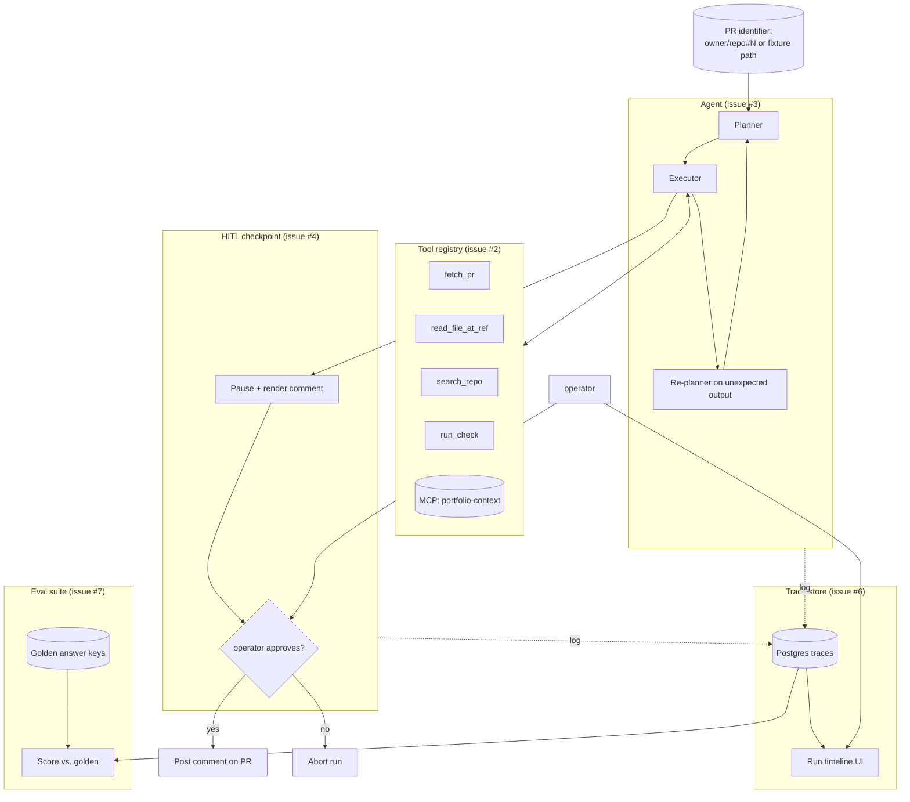

# Architecture

The agent's shape is locked by the use-case decision (D-002, see
[`use-case.md`](./use-case.md)): **PR review agent**. Every component below
is sized for that single purpose.

## Locked by this PR (issue #1)

- **Use case** — PR review agent, not research brief. (D-002.)
- **Input shape** — `fixtures/sample-prs/<slug>.json` with the v1 schema
  documented in [`fixtures/sample-prs/SCHEMA.md`](../fixtures/sample-prs/SCHEMA.md).
- **Output shape** — summary paragraph + severity-tagged findings + final
  recommendation, structured per [`use-case.md`](./use-case.md).
- **Tool contract** — five named tools (one of them a custom MCP server)
  with knowable signatures listed in `use-case.md`.

## Pending downstream (open issues)

- **#2** — Implement the five tools. Custom MCP server (`portfolio-context`)
  also lands in `mcp-server-cookbook` for cross-repo reuse.
- **#3** — Planner → Executor → Re-planner loop with explicit decision points
  visible in the trace.
- **#4** — HITL checkpoint before posting any comment to a real PR. Replay
  mode no-ops the checkpoint.
- **#6** — Postgres trace schema + minimal React UI for run inspection.
- **#7** — Eval suite that scores agent findings against golden answer keys
  on the committed fixtures, importing `llm-eval-harness`.

## Stack

- **TypeScript / Node** for the agent core (per portfolio handoff §2 stack).
- **Anthropic SDK** for model calls.
- **Custom MCP server** (Node) for the `portfolio-context` tool.
- **Postgres** for trace persistence (single container).
- **React** (minimal) for the trace inspection UI.

The TS scaffolding (`package.json`, `tsconfig.json`, vitest, eslint) is
deliberately not added in this PR — it lands with #2 where the first real
code arrives. Adding empty scaffolding now would create dead surface.
